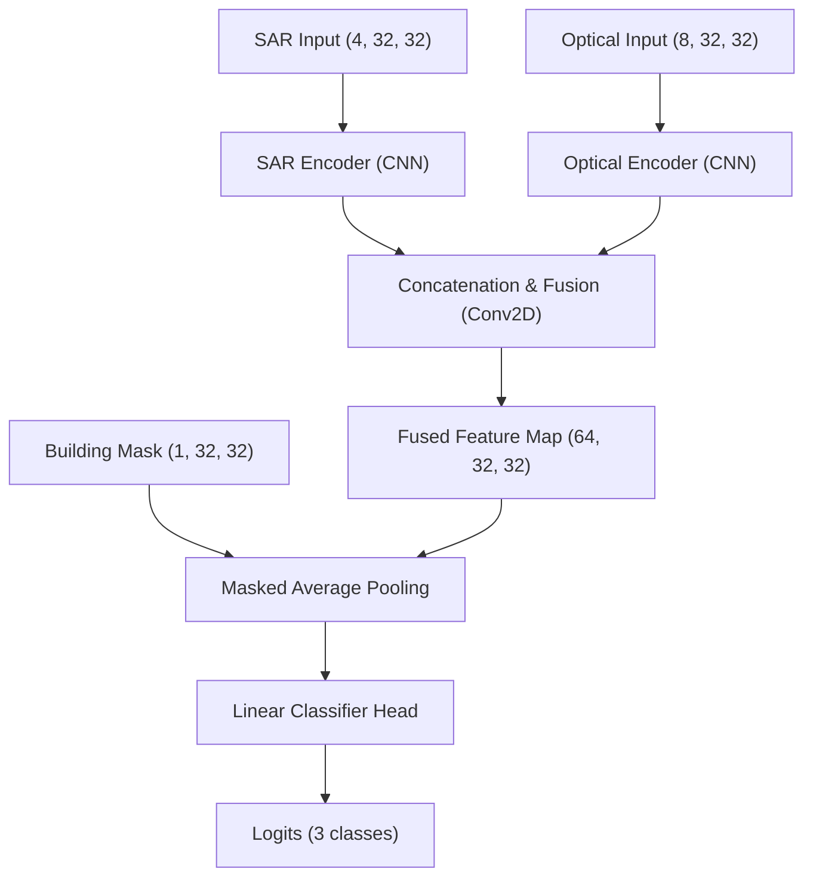

# Phase 6 Model Training Documentation

This document describes the dual-stream U-Net architecture, training process, parameters, and loss function used to classify building damage.

## 1. Model Architecture: Dual-Stream U-Net
The model employs a siamese/dual-stream feature extractor that processes Sentinel-1 (SAR) and Sentinel-2 (optical) pre/post imagery separately:

### Stream 1: SAR Stream
- **Input:** PRE `[VV, VH]` and POST `[VV, VH]` stacked (4 channels, 32x32).
- **Encoder:** Multi-layer Conv2D with BatchNorm and ReLU.

### Stream 2: Optical Stream
- **Input:** PRE `[B2, B3, B4, B8]` and POST `[B2, B3, B4, B8]` stacked (8 channels, 32x32).
- **Encoder:** Multi-layer Conv2D with BatchNorm and ReLU.

### Feature Fusion and Classifier Head
- Features from both encoders are concatenated along the channel dimension.
- **Masked Average Pooling:** Features are multiplied by the building footprint mask so that only pixels belonging to the building contribute to the classification.
- The pooled building feature vector (64 channels) is passed to a Linear classifier to output logits for class 0 (Intact), class 1 (Damaged), and class 2 (Destroyed).

## 2. Loss Function
- We use **Focal Loss** to address severe class imbalance (Intact buildings represent the majority of the dataset).
- Focal Loss dynamically scales the loss based on prediction confidence:
  $$\text{FL}(p_t) = -\alpha_t (1 - p_t)^\gamma \log(p_t)$$
- We set $\gamma = 2.0$ and use class weights computed from the training split.

## 3. Assumptions and Limitations
- **Resolution Limit:** Sentinel imagery at 10m spatial resolution is supporting evidence. The model cannot detect small structural cracks but captures heavy damage and total destruction.
- **Mask Requirement:** Accurate building footprints are required.
