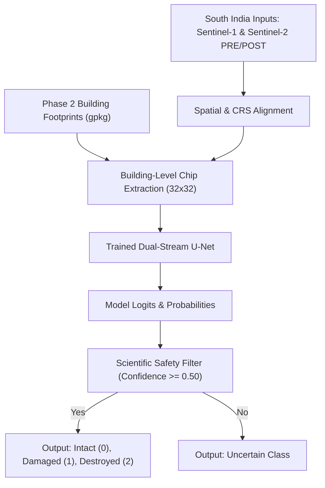

# South India Inference Pipeline Architecture

This document describes the design, scientific safety guidelines, and deployment configuration for applying the trained model to South India (Chennai, Cuddalore, Nagapattinam).

## 1. Inference Pipeline Layout

The inference pipeline is designed as a building-centric classification workflow:

## 2. Separation of Training and South India Validation Data
- **Training Source:** The model is trained exclusively on the **xBD-S12 global dataset**.
- **South India Target:** The manual annotations for Chennai (20 buildings) and Cuddalore (10 buildings) are preserved and used **only for final local validation and adaptation testing**. They are never mixed into the training or validation splits of the xBD dataset.

## 3. Scientific Safety Rules
- **Resolution Limits:** Because Sentinel-1 and Sentinel-2 pixel size is 10 meters, individual-building structural damage cannot be detected with absolute certainty from imagery alone.
- **Uncertainty Classification:**
  - If the model's highest predicted probability is below **0.50**, the building is labeled **"uncertain"**.
  - This prevents false classification of damage in areas with heavy shadow, cloud cover, or poor alignment.
- **No Scientific Overstatement:** In reports, the term **"building damage classification"** is used instead of "building collapse detected" unless verified by ground truth or high-resolution imagery.
